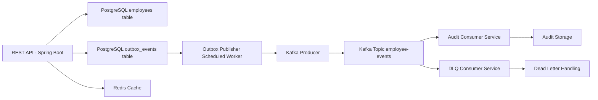

# Employee Management API

**Event-Driven Backend System**

---

## Overview

This project is a **production-oriented backend system** that demonstrates how a typical CRUD service evolves into a **scalable, event-driven architecture**.

The focus is:

* Designing for failure
* Ensuring data consistency across boundaries
* Enabling horizontal scalability
* Making explicit trade-offs between simplicity and correctness
---

## What This System Demonstrates

* Layered architecture (Controller → Service → Repository)
* Strict DTO boundaries (no entity leakage)
* Soft delete strategy (audit-friendly data lifecycle)
* Offset pagination with filtering
* Consistent exception handling (404, 409, 500)
* Database indexing for query performance
* Redis-based read caching
* Transactional Outbox Pattern for reliable event publishing
* Kafka-based event-driven communication

---

## Tech Stack

* Java + Spring Boot
* PostgreSQL (Docker)
* JPA / Hibernate
* Redis (Spring Cache)
* Kafka
* Lombok
* Logback

---

## Running Locally

### Prerequisites

* Docker and Docker Compose installed
* Java 17+ and Maven installed (or use the included `./mvnw` wrapper — adjust if this project uses Gradle instead)
* A DB browser client — e.g. [DBeaver](https://dbeaver.io/) or [pgAdmin](https://www.pgadmin.org/) — for inspecting Postgres tables directly

### 1. Start the infrastructure (Postgres, Kafka, Redis)

From the project root:

```bash
docker compose up -d
```

This brings up Postgres, Kafka, and Redis as defined in `docker-compose.yml`. Confirm all containers are healthy before continuing:

```bash
docker compose ps
```

All services should show as `Up` (or `healthy` if healthchecks are configured). If any container is restarting or exiting, check its logs before moving on:

```bash
docker compose logs -f <service-name>
```

### 2. Run the Spring Boot application

```bash
./mvnw spring-boot:run
```

On startup, check the console for:

* Successful connection to Postgres (no connection-refused or credential errors)
* Successful connection to Kafka (no broker-unreachable errors)
* Successful connection to Redis
* The scheduled Outbox Publisher initializing without errors

If the app fails to start, the stack trace will usually point to whichever dependency isn't reachable yet — Postgres/Kafka/Redis can take a few seconds after `docker compose up` before they're ready to accept connections, so a restart of the app is sometimes all that's needed.

### 3. Verify the database connection using a DB browser

Connect your DB browser (DBeaver, pgAdmin, etc.) to the Postgres instance using the credentials and port defined in `docker-compose.yml` (default Postgres port is `5432` unless overridden).

Once connected, you should be able to see and query:

* `employees` — the main entity table
* `outbox_events` — the outbox table, including the `processed` flag column

---

## Testing the Flow End-to-End

### 1. Create an employee via the API

```bash
curl -X POST http://localhost:8080/employees \
-H "Content-Type: application/json" \
-d '{
  "name": "Test User",
  "email": "test@example.com"
}'
```

### 2. Check the database for the new records

In your DB browser, run:

```sql
SELECT * FROM employees ORDER BY created_at DESC LIMIT 5;
SELECT * FROM outbox_events ORDER BY created_at DESC LIMIT 5;
```

* Confirm a new row exists in `employees`.
* Confirm a corresponding row exists in `outbox_events` with `processed = false`.

### 3. Confirm the outbox event gets published

Wait a few seconds for the scheduled Outbox Publisher to run, then re-run the `outbox_events` query above. The `processed` flag on that row should flip to `true`. If it stays `false`, check the application logs for publisher errors before moving further down the chain.

### 4. Check the event actually landed in Kafka

Verify this independently of your own consumers, directly against the topic, using the Kafka console consumer inside the running Kafka container:

```bash
docker exec -it kafka kafka-console-consumer --bootstrap-server localhost:9092 --topic employee-events --from-beginning | jq '.'
```

This prints every message currently in the `employee-events` topic from the beginning, piped through `jq` for readable, pretty-printed JSON. (Requires `jq` installed locally — `brew install jq` on macOS, `apt install jq` on Debian/Ubuntu.) You should see the JSON event corresponding to the employee you just created (matching the `eventId`/`employeeId` from the outbox row). Leave this running in a separate terminal — it's useful to keep open while testing, so new events appear live as you hit the API.

Press `Ctrl+C` to exit the consumer when done.

### 5. Confirm the consumers processed the event

Check the application logs for the Audit Consumer and DLQ Consumer around the same timestamp — confirm the Audit Consumer logged that it processed the event, and confirm the corresponding record exists in Audit Storage. The DLQ Consumer should show no activity for a normal, successful flow.

---

## System Architecture


```mermaid
flowchart LR

A[REST API - Spring Boot] --> B[PostgreSQL employees table]
A --> C[PostgreSQL outbox_events table]

C --> D[Outbox Publisher Scheduled Worker]
D --> E[Kafka Producer]

E --> F[Kafka Topic employee-events]

F --> G1[Audit Consumer Service]
F --> G2[DLQ Consumer Service]

G1 --> H1[Audit Storage]
G2 --> H2[Dead Letter Handling]

A --> R[Redis Cache]
```

---

## Architecture Flow

1. API request hits `EmployeeService`
2. Employee is persisted in PostgreSQL
3. A corresponding event is written to `outbox_events` (same transaction)
4. Background publisher polls outbox table
5. Events are published to Kafka
6. Consumers process events independently

This ensures:

* No lost events
* No dual-write inconsistency
* Safe retries

---

## Key Design Decisions

### 1. Transactional Outbox Pattern

Instead of publishing directly to Kafka within the request flow, events are first written to a database-backed outbox.

**Why this matters:**

* Avoids dual-write problems (DB + Kafka inconsistency)
* Guarantees event durability
* Enables retries without data loss

**Implementation details:**

* `processed = false` flag controls lifecycle
* Batched polling using a scheduled worker
* `FOR UPDATE SKIP LOCKED` ensures safe parallel processing
* Events marked processed only after successful publish

---

### 2. Event-Driven Architecture (Kafka)

* Domain events (`EmployeeEvent`) are emitted for all state changes
* Kafka acts as the central event backbone
* Consumers are decoupled and independently scalable

This allows:

* Async workflows
* Service decoupling
* Future extensibility (notifications, analytics, etc.)

---

### 3. Redis Caching (Read Optimization)

* `@Cacheable` used for employee reads
* `@CacheEvict` ensures cache consistency on updates/deletes

Trade-off:

* Slight complexity increase for significant read performance gains

---

### 4. Soft Delete Strategy

Instead of deleting records:

* Records are marked `INACTIVE`

Benefits:

* Preserves history
* Prevents accidental data loss
* Aligns with audit/compliance requirements

---

### 5. DTO-Based API Design

Entities are never exposed externally.

Benefits:

* Prevents tight coupling
* Enables independent API evolution
* Avoids ORM-related issues (lazy loading, serialization)

---

### 6. Validation Strategy

Email uniqueness enforced at:

* Application layer (better UX)
* Database layer (strong consistency)

---

### 7. Pagination Strategy

* Offset-based pagination implemented

Trade-off:

* Simple but inefficient for large datasets

Planned:

* Cursor-based pagination for scalability

---

## Components

### Employee Service

* Handles CRUD operations
* Applies business validation
* Writes to database and outbox

---

### Outbox Publisher

* Scheduled worker (`@Scheduled`)
* Polls unprocessed events in batches
* Publishes to Kafka
* Marks events as processed

---

### Kafka Consumers (Audit / DLQ)

* Consume `employee-events`
* Persist audit logs
* Handle failure scenarios (DLQ path)

---

### Redis Cache

* Speeds up read-heavy operations
* Keeps frequently accessed data in memory

---

## API Endpoints

### Create Employee

```http
POST /employees
```

```bash
curl -X POST http://localhost:8080/employees \
-H "Content-Type: application/json" \
-d '{
  "name": "Test User",
  "email": "test@example.com"
}'
```

---

### Get Employee

```http
GET /employees/{id}
```

---

### Update Employee

```http
PUT /employees/{id}
```

---

### Delete Employee (Soft Delete)

```http
DELETE /employees/{id}
```

---

### List Employees

```http
GET /employees?page=0&size=10&departmentId=<optional>
```

---

## Sample Event

```json
{
  "eventId": "uuid",
  "eventType": "CREATE",
  "employeeId": "uuid",
  "details": "Employee created"
}
```

---

## Testing Strategy (Current State - needs further improvement)

* Unit tests for service layer (mocked dependencies)
* Repository tests using JPA test slice
* Focus on:

  * Validation logic
  * Outbox event creation
  * Soft delete behavior

---

## Limitations (Current Design)

* Polling-based outbox (not real-time)
* Scheduler introduces latency (few seconds)
* Single-table outbox may need partitioning at scale

---

## Roadmap

### Scalability Improvements

* Cursor-based pagination
* Partitioned outbox processing
* Parallel publisher scaling

---

### Eventing Evolution

* Replace polling with CDC (Debezium)
* Stream database changes directly to Kafka
* Achieve near real-time propagation

---

### Performance

* Advanced Redis strategies (TTL, eviction tuning)
* Load testing (k6 / JMeter)

---

### Observability

* Metrics (Prometheus + Grafana)
* Structured logging
* Distributed tracing

---

### Reliability

* Idempotent consumers
* Retry + backoff strategies
* DLQ automation

---

### CI/CD

* Integration tests with Testcontainers
* GitHub Actions pipeline

---

## Design Philosophy

This system is intentionally built to reflect **real-world backend evolution**:

* Start simple (CRUD)
* Introduce consistency guarantees (Outbox)
* Move to asynchronous systems (Kafka)
* Optimize reads (Redis)
* Prepare for distributed scaling

The emphasis is on:

* Explicit trade-offs
* Incremental complexity
* Production readiness over shortcuts

---

## Next Step

Introduce **Change Data Capture (CDC)** using Debezium:

* Eliminate polling
* Stream DB changes directly to Kafka
* Reduce latency
* Align with industry-standard event streaming architectures

---